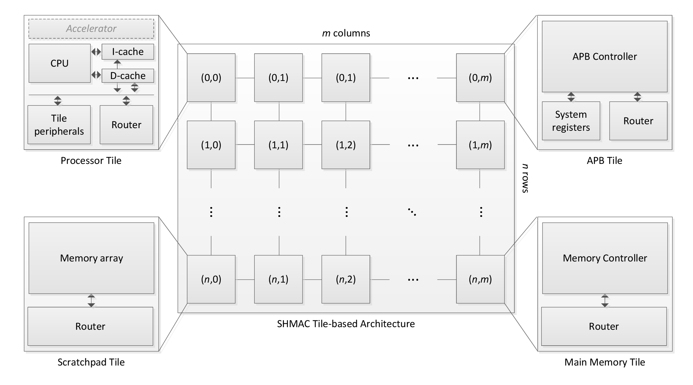
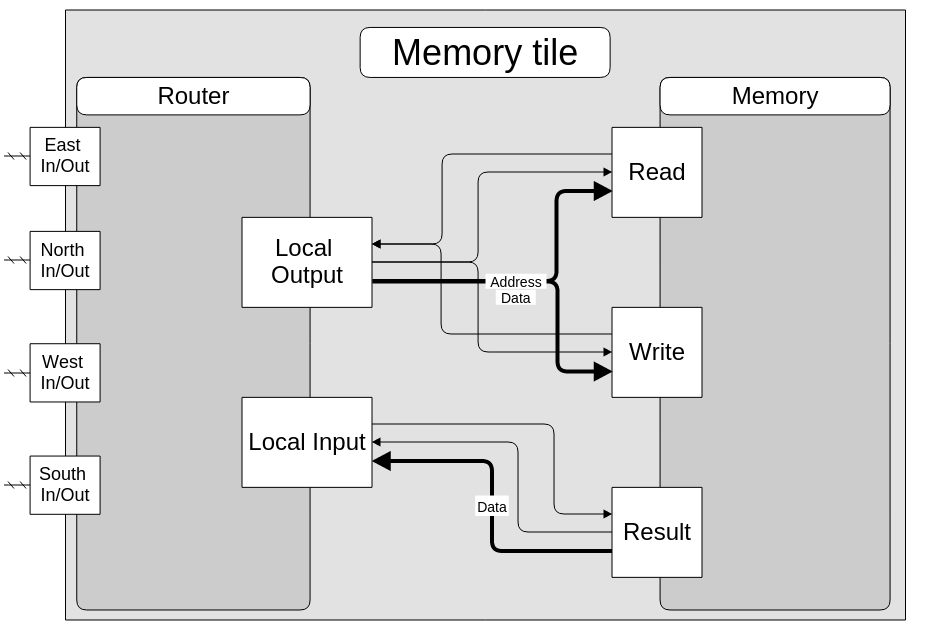
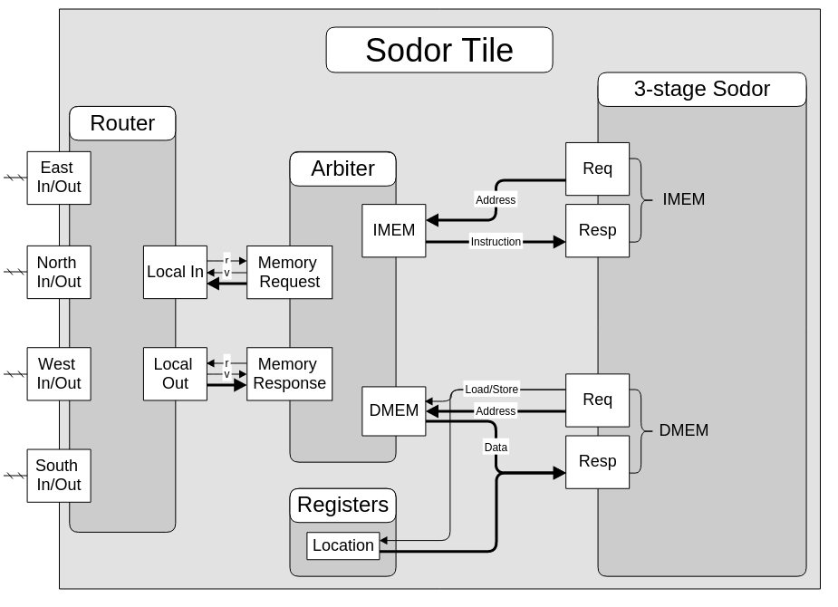
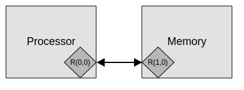
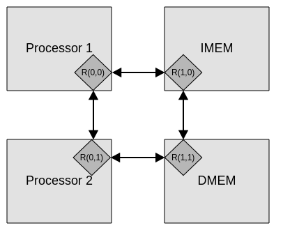

# Chisel-SHMAC
A prototype of The Single-ISA Heterogeneous MAny-core Computer (SHMAC) written in the
[Chisel Hardware Construction Language](https://chisel.eecs.berkeley.edu/).
Chisel is a Scala-embedded HDL and requires the [Simple Build Tool](http://www.scala-sbt.org/)
to work.

The project was part of the ongoing [SHMAC](http://www.ntnu.edu/ime/eecs/shmac) research project at
NTNU. It's main purpose was to investigate the possibility for a SHMAC based on the
[RISC-V](http://riscv.org/) Instruction Set Architecture.

## Project structure
The project consists of several modules that together make up a prototype of the SHMAC.
The architecture of the project is described below. Those interested can also look at the final
[project report](doc/project-report.pdf).

A high-level overview of the SHMAC architecture is shown below.



### Router
A router is one of the most fundamental parts of a heterogeneous computer, this is an implementation
of a router that implements an XY-routing routing algorithm for the packages in the network.

Each tile in the network are connected together with the routers, the figure below shows a detailed
architecture of the router.


### Memory
The memory is a simple module that supports read and writes, and simply wraps around a Chisel Mem
object.

### Sodor
This project utilizes a 3-Stage Sodor processor core from the
[Sodor Processor Collection](https://github.com/ucb-bar/riscv-sodor). The processor core had to
be modified slightly in order to support arbitrary memory stalls, which is an important requirement
for heterogeneous systems.

### Tiles
Two different tiles are implemented, a *Memory Tile* and a *Sodor Tile*. The two tiles wraps around
the *Memory module* and the *Sodor module*, respectively, and connects these two modules together
with a *Router*. These tiles acts as the basic building blocks, that can be combined in order to
make a prototype of the SHMAC.

The architecture of the two tiles are shown below.





### SHMAC
At last, two small prototypes of the SHMAC are included in the project.

#### Prototype 1
The first prototypes
demonstrates a simple system with one processor core and one memory element.



#### Prototype 2
The second prototype demonstrates a system with two processor that executes the *same* programs, but
behaves differently based on their location in the interconnect-network.



## Running tests and simulations
All the components and modules have been tested and simulated. The tests are initiated in a simple
test-runner found in `TestMain.scala`. The projects Makefile can be used to run unit-level tests,
module-level tests, or all tests.

Run all tests:

```$ make```

Test a module, e.g.

```$ make router```

Run a single unit test, e.g.

```$ make CrossBar.out```
